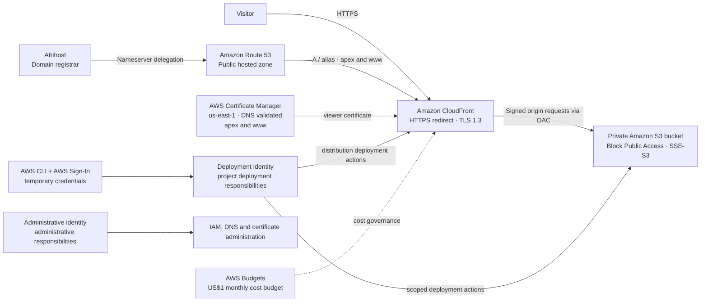

# Shannon Cloud Portfolio

A static portfolio website delivered through a private Amazon S3 origin and Amazon CloudFront. The project demonstrates a practical AWS hosting design, domain and TLS configuration, scoped deployment responsibilities, and cost-aware decisions.

## Architecture at a glance

The diagram summarizes the deployed design; dotted links indicate supporting control or administration relationships rather than website traffic.

## Highlights

- S3 is private, with S3 Block Public Access enabled and SSE-S3 default encryption.
- CloudFront is the public delivery layer. It redirects HTTP to HTTPS and supports TLS 1.3 for viewer connections.
- CloudFront accesses S3 through Origin Access Control (OAC); the bucket is not configured for public website access.
- Route 53 hosts the public DNS zone. Apex and `www` records are aliases to the CloudFront distribution. Afrihost remains the registrar.
- AWS Certificate Manager (ACM) provides the CloudFront viewer certificate from `us-east-1`. DNS validation covers both the apex and `www` hostnames.
- AWS CLI access uses AWS Sign-In temporary credentials rather than long-lived access keys.
- A monthly US$1 AWS Budget is configured. No budget notifications are configured.
- S3 versioning is intentionally disabled as a cost-control choice; Git and GitHub provide source history for the site and its documentation.

## IAM responsibilities

Two IAM identities separate routine project deployment from account administration:

- **Deployment identity** handles the defined portfolio deployment scope.
- **Administrative identity** handles IAM, Route 53, ACM, and other account-level configuration.

MFA is enabled on both identities. Permissions are designed to follow least privilege within each identity's defined responsibilities and the project's deployment scope. The goal is appropriate control of the work each identity must perform, not an artificially small permission set that prevents the deployment role from doing its assigned job.

## Documentation

- [Architecture overview](docs/architecture.md)
- [AWS services](docs/aws-services.md)
- [Cost management](docs/cost-management.md)
- [Deployment](docs/deployment.md)
- [Security](docs/security.md)
- [Architecture diagram source](architecture/aws-architecture.md)

## Scope and design choices

This is a small static portfolio project. WAF, Shield Advanced, and CloudFront Origin Shield were not added because their additional cost and operational complexity were not justified by this project's requirements and traffic profile. Their absence is a deliberate scope decision, not a claim that they are never useful.

## Status

The AWS architecture and security configuration described here were verified in the AWS account. This repository contains documentation for the deployed architecture and its operating approach. It does not contain credentials, secrets, or AWS account-specific identifiers.
