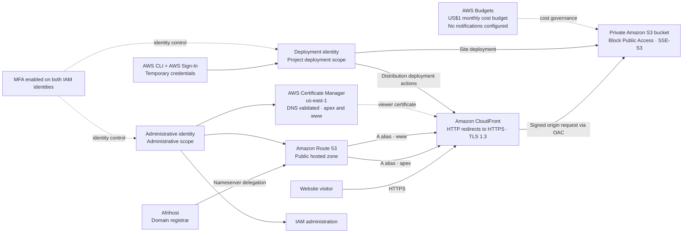

# AWS portfolio architecture

This file is the GitHub-friendly source for the portfolio architecture diagram. The Mermaid block below is rendered by GitHub as a diagram.

## Diagram

## Diagram notes

- The solid top path represents visitor delivery: DNS resolves both hostnames to CloudFront, and CloudFront serves content from the private S3 origin through OAC.
- ACM's certificate is attached to CloudFront for viewer HTTPS. CloudFront certificates must be provisioned in `us-east-1`; DNS validation covers apex and `www`.
- Afrihost is the registrar. Route 53 is the public DNS host after nameserver delegation.
- The deployment identity is used for project deployment; the administrative identity handles account administration such as IAM, Route 53, and ACM. Both identities have MFA.
- AWS CLI authentication uses AWS Sign-In temporary credentials. No long-lived access keys are used for the described workflow.
- The monthly US$1 budget has no notifications configured. It is a budget limit, not an alerting mechanism.
- S3 versioning is intentionally disabled as a cost decision. Git/GitHub preserve source history.
- WAF, Shield Advanced, and Origin Shield are outside this small project's current scope.

Do not add account IDs, certificate ARNs, MFA serial numbers, or credential material to this diagram or its source.
