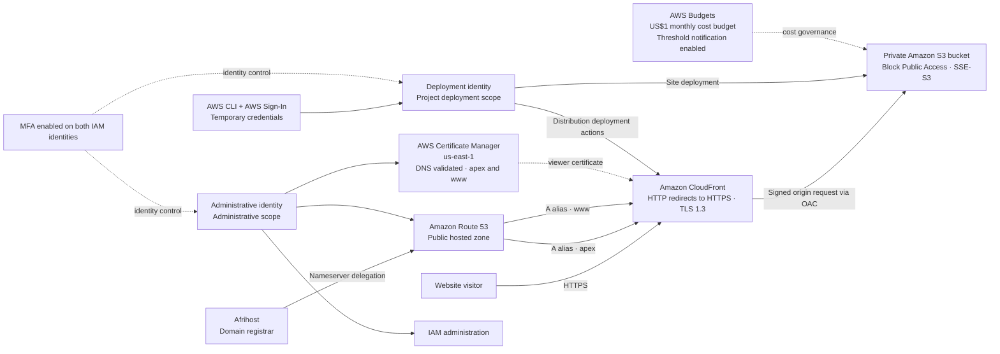

# AWS portfolio architecture

This file is the GitHub-friendly source for the portfolio architecture diagram. The Mermaid block below is rendered by GitHub as a diagram.

## Diagram

```mermaid
flowchart LR
    Visitor[Website visitor] -->|HTTPS| CF[Amazon CloudFront\nHTTP redirects to HTTPS · TLS 1.3]

    Registrar[Afrihost\nDomain registrar] -->|Nameserver delegation| DNS[Amazon Route 53\nPublic hosted zone]
    DNS -->|A alias · apex| CF
    DNS -->|A alias · www| CF

    ACM[AWS Certificate Manager\nus-east-1\nDNS validated · apex and www] -. viewer certificate .-> CF

    CF -->|Signed origin request via OAC| S3[Private Amazon S3 bucket\nBlock Public Access · SSE-S3]

    CLI[AWS CLI + AWS Sign-In\nTemporary credentials] --> Deploy[Deployment identity\nProject deployment scope]
    Deploy -->|Site deployment| S3
    Deploy -->|Distribution deployment actions| CF

    Admin[Administrative identity\nAdministrative scope] --> IAM[IAM administration]
    Admin --> DNS
    Admin --> ACM
    MFA[MFA enabled on both IAM identities] -. identity control .-> Deploy
    MFA -. identity control .-> Admin

    Budget[AWS Budgets\nUS$1 monthly cost budget\nThreshold notification enabled] -. cost governance .-> S3
```

## Diagram notes

- The solid top path represents visitor delivery: DNS resolves both hostnames to CloudFront, and CloudFront serves content from the private S3 origin through OAC.
- ACM's certificate is attached to CloudFront for viewer HTTPS. CloudFront certificates must be provisioned in `us-east-1`; DNS validation covers apex and `www`.
- Afrihost is the registrar. Route 53 is the public DNS host after nameserver delegation.
- The deployment identity is used for project deployment; the administrative identity handles account administration such as IAM, Route 53, and ACM. Both identities have MFA.
- AWS CLI authentication uses AWS Sign-In temporary credentials. No long-lived access keys are used for the described workflow.
- The monthly US$1 budget has a notification configured to alert when spending exceeds the threshold. It supports cost monitoring but does not cap spending or automatically stop services.
- S3 versioning is intentionally disabled as a cost decision. Git and GitHub preserve source history, while recovery of deployed content requires redeployment.
- AWS WAF, AWS Shield Advanced, and CloudFront Origin Shield are outside this small project's current scope and can be reassessed if requirements or risk change.

Do not add account IDs, certificate ARNs, MFA serial numbers, or credential material to this diagram or its source.
